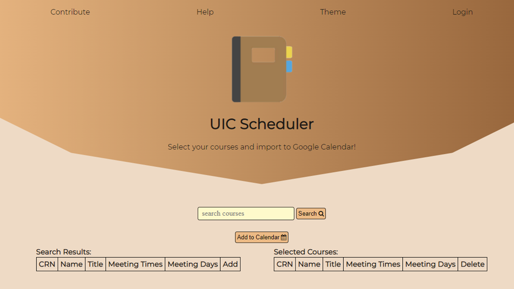
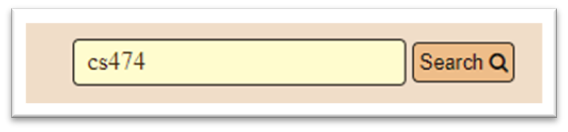
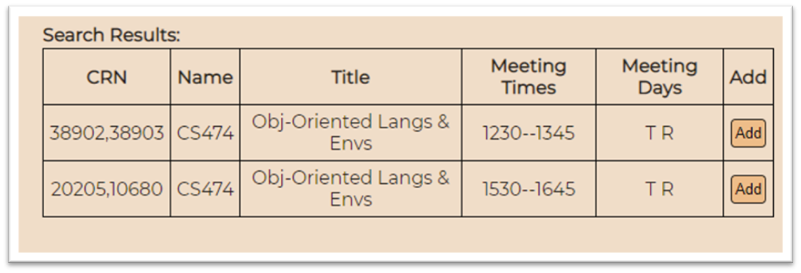
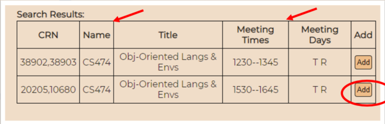
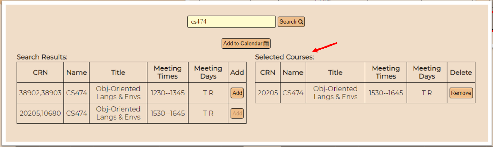
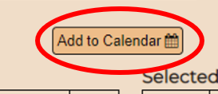
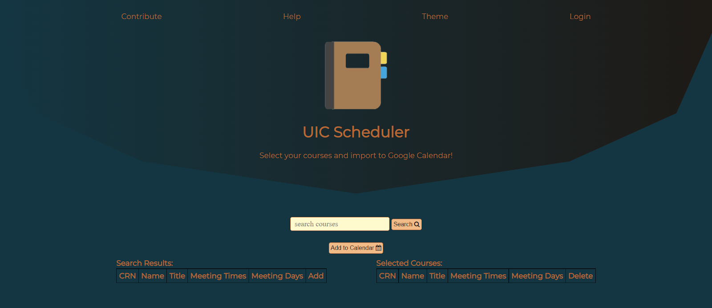

# UIC Scheduler
UIC Scheduler is a webapp for UIC students to add courses automatically to digital calendars.
(Only has data of the Fall 2021 semester. Deployment pending.)

The app consists of a single webpage that makes requests to a Node.js server. This server in turn makes requests to a MySQL database containing information regarding UIC courses. I've ran the server locally using Apache and phpMyAdmin.

## Demo

1. Homepage



2. Searching course “cs474”:



3. Response from server:



4. Note there are two CRNs for a single course in this case. One course meets on Tuesdays and Thursdays from 12:30pm-1:45pm and a second course meets on Tuesdays and Thursdays from 3:30pm-4:45pm. The student may then add a course. For example, the second one:



5. The selected courses are shown on a second table, as seen below.



6. When the user is finished selecting all his courses, he may click the following button to add the courses to a calendar file.



7. The file will automatically download, after which the user is free to add to any digital calendar of his choosing.

8. Dark Theme




## How to use (partial)
### Database:

The UIC courses are not in this repository as I do not yet have permission to display them publicly.

### Server:
```
cd server
nodemon app
```
### Client:
Open the index.html file in your browser manually.
